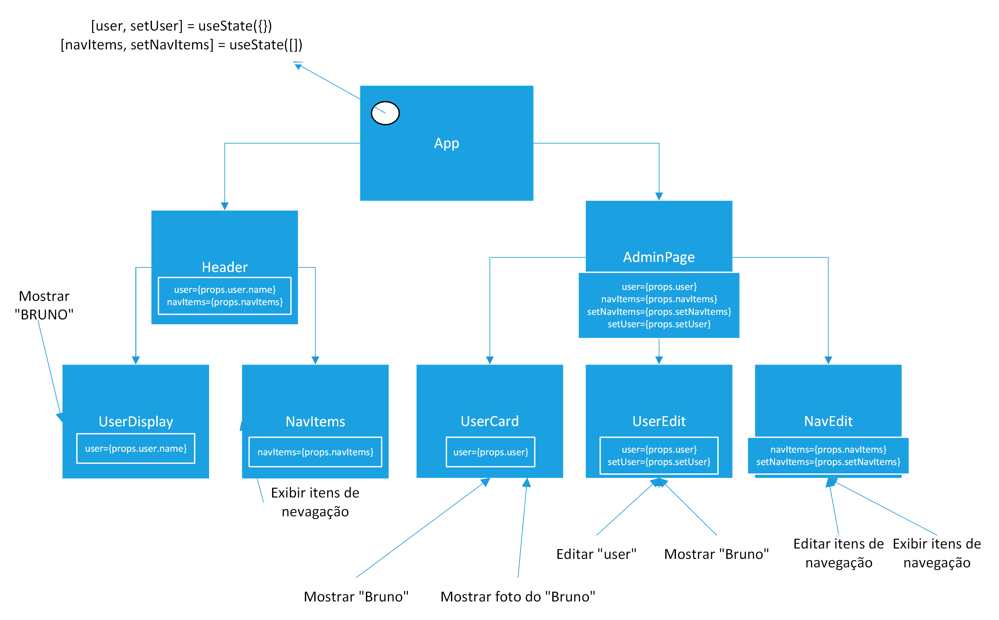
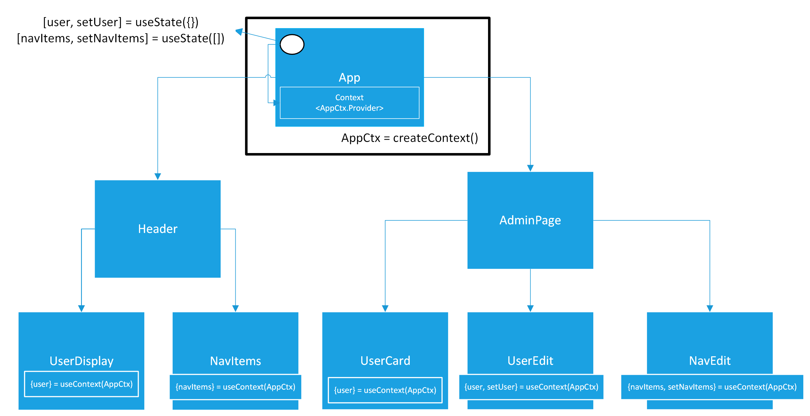
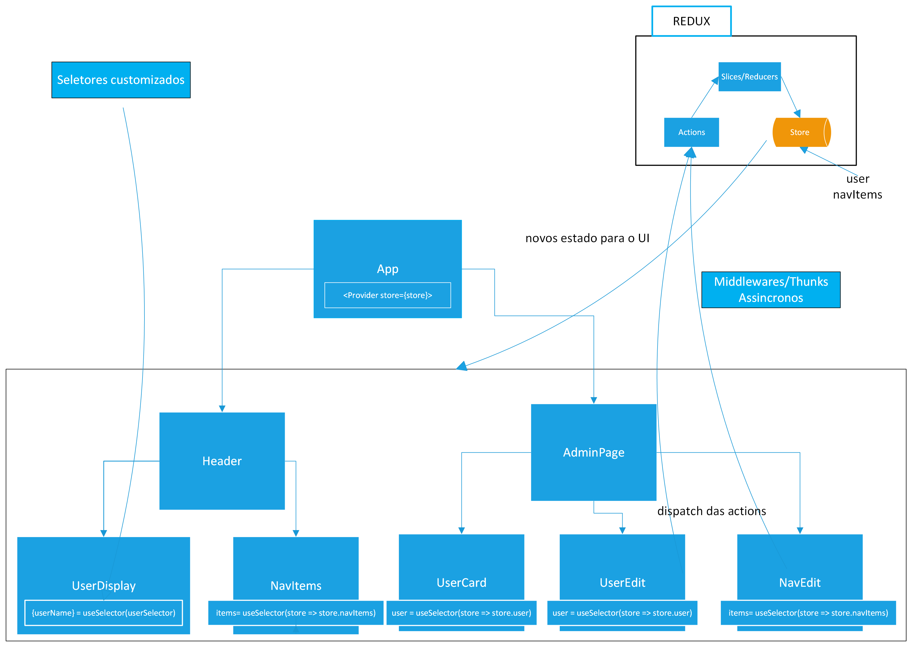
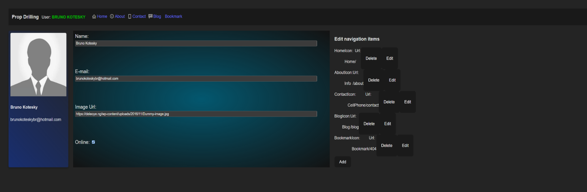

### React State Management Examples

This repository has the purpose to show five different ways to manage state in React, using `Local State Management`, `Prop Drilling`, `React Context`, `Redux Toolkit` and `Zustand`.

Based on the same Application (Except for the local state management, being simple examples.)

The application is a simple application with the option to view the user data, edit the user data, and edit the navigation bar (CRUD), with four different approaches, using the same components (styles) and app logic.
    *Please ignore the css, thats not the main purpose.*

These are the diagrams of the application, not including a diagram for Zustand (The text is in Brazilian Portuguese, but the images are self-explanatory):

- Prop Drilling:
    

- Context:
    

- Redux (Flux Pattern):
    

**Application**:
    